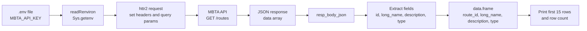

# MBTA Routes API Query – Script Documentation

## Overview

This README documents the `my_good_query.r` script, which queries the **MBTA (Massachusetts Bay Transportation Authority) v3 API** to retrieve information about transit routes.  
The script:

- Loads a private API key from a local `.env` file
- Sends an authenticated GET request using `httr2`
- Parses the JSON response into an R data frame
- Prints a preview of the first 15 routes for inspection

This script is intended as a starting point for building a **reporter-style application** that summarizes or visualizes transit routes.

---

## API Endpoint and Parameters

- **Base URL**: `https://api-v3.mbta.com/routes`
- **HTTP Method**: `GET`

**Headers**

- `x-api-key`: your MBTA API key, loaded from `Sys.getenv("MBTA_API_KEY")`
- `accept`: `"application/vnd.api+json"` (requests JSON:API formatted data)

**Query Parameters**

- ``page[limit]``: set to `20` in the script to limit the number of routes returned

Example of the request chain in R (simplified):

```r
resp = request("https://api-v3.mbta.com/routes") |>
  req_headers(`x-api-key` = key, accept = "application/vnd.api+json") |>
  req_url_query(`page[limit]` = 20) |>
  req_perform()
```

Error handling in the script checks:

- That `MBTA_API_KEY` is present in `.env`
- That the HTTP status code is `200`; otherwise it prints the response body and stops with an error

---

## Data Structure Returned

The MBTA API returns JSON in **JSON:API** format. The script focuses on the `data` field, which is a list of route objects.

Each element of `obj$data` contains:

- `id`: the route ID (e.g., `"1"`, `"Red"`)
- `attributes$long_name`: human-readable route name
- `attributes$description`: description of the route (e.g., `"Key Bus Route"`, `"Rapid Transit"`)
- `attributes$type`: numeric route type (e.g., `0` = light rail, `1` = heavy rail, etc.)

The script converts this list into a data frame with the following columns:

- `route_id` – route identifier (`id`)
- `long_name` – long, descriptive name of the route
- `description` – text description of the route
- `type` – numeric code indicating the route type

Only the first 15 rows are printed, but the full data frame may contain up to the number of routes returned by the API (based on the `page[limit]` parameter).

---

## Data Flow Diagram (Mermaid)



This diagram shows how the API key, request, JSON response, and resulting data frame connect within the script.

---

## Usage Instructions

1. **Install required R packages (once per environment)**

   ```r
   install.packages("httr2")
   install.packages("jsonlite")
   ```

2. **Create a `.env` file in the project root (same directory as the script or R working directory)**

   ```text
   MBTA_API_KEY=your_real_mbta_api_key_here
   ```

3. **Run the script**

   From R, RStudio, or VS Code/Posit:

   ```r
   source("my_good_query.r")
   ```

   The script will:

   - Load the `.env` file with `readRenviron(".env")`
   - Confirm that `MBTA_API_KEY` was found
   - Make the API request and check for status `200`
   - Parse the JSON response
   - Build a data frame of routes and print:
     - The total number of records
     - A preview of up to the first 15 routes

4. **Using the result in further analysis**

   If you want to reuse the data frame later in the same R session, you can simply reference `df` (created at the end of `my_good_query.r`) or modify the script to save it, for example:

   ```r
   # Example extension: write the routes to CSV for later use
   readr::write_csv(df, "mbta_routes.csv")
   ```

This README should give you enough context to understand what the script does, how it uses the MBTA API, what data it returns, and how to run and extend it for your own analyses or reporter applications.

