# MBTA Commute Reliability Assistant – Application Documentation

## Overview

This application provides a **reliability-focused commute planning tool** for MBTA transit users. Unlike traditional route planners that prioritize speed, this assistant helps users find the most **stable and predictable** routes based on real-time transit data and historical patterns.

The application offers three key features:

- **Reliability-first route recommendation**: Suggests routes based on consistency and on-time performance rather than just travel time
- **Bunching detection and warning**: Identifies when multiple vehicles are clustered together (bunching), which can lead to longer wait times
- **Leave-by window**: Provides a recommended time window for departure to maximize reliability and minimize wait times

This tool uses the **MBTA V3 API** to access real-time transit data and help commuters make more informed decisions about their daily travel.

---

## Data Sources

The application queries the **MBTA V3 API** to retrieve real-time and static transit information. The following endpoints are used:

- `/predictions` – Real-time arrival predictions for stops and routes
- `/vehicles` – Current vehicle locations and status information
- `/alerts` – Service alerts, delays, and disruptions affecting routes
- `/routes` – Route information including names, types, and descriptions

These endpoints provide the data necessary to analyze route reliability, detect vehicle bunching, and calculate optimal departure windows.

---

## Data Flow Diagram (Mermaid)

```mermaid
flowchart LR
    A[.env file\nMBTA_API_KEY] --> B[Load API Key\nreadRenviron]
    B --> C[Query MBTA API\n/predictions, /vehicles]
    C --> D[Query MBTA API\n/alerts, /routes]
    D --> E[Process Real-time Data\narrival times, vehicle positions]
    E --> F[Analyze Reliability\ncalculate consistency metrics]
    F --> G[Detect Bunching\nidentify clustered vehicles]
    G --> H[Calculate Leave-by Window\noptimal departure time range]
    H --> I[Generate Recommendations\nreliable routes + warnings]
    I --> J[Display Results to User\nroute suggestions + timing]
```



This diagram shows how the application loads API credentials, queries multiple MBTA endpoints, processes the data to analyze reliability and detect issues, then generates and displays recommendations to the user.

---

## Setup Instructions

1. **Install required R packages (once per environment)**

   ```r
   install.packages("httr2")
   install.packages("jsonlite")
   install.packages("dplyr")
   ```

2. **Create a `.env` file in the project root**

   Create a `.env` file in the same directory as your application script with the following content:

   ```text
   MBTA_API_KEY=your_mbta_api_key_here
   ```

   Replace `your_mbta_api_key_here` with your actual MBTA API key. You can obtain an API key by registering at the [MBTA Developer Portal](https://api-v3.mbta.com/).

3. **Verify API key is loaded**

   The application will automatically load the API key from the `.env` file using `readRenviron(".env")` and check that `MBTA_API_KEY` is present before making API requests.

---

## Usage Instructions

1. **Launch the application**

   From R, RStudio, or VS Code/Posit:

   ```r
   source("mbta_reliability_app.r")
   ```

   Or if using a Shiny application:

   ```r
   shiny::runApp("mbta_reliability_app")
   ```

2. **Select your origin and destination**

   - Enter your starting location (stop name or route)
   - Enter your destination (stop name or route)
   - Optionally specify your preferred departure time or time window

3. **Review reliability recommendations**

   The application will display:

   - **Recommended routes** ranked by reliability (not just speed)
   - **Bunching warnings** if multiple vehicles are clustered together
   - **Leave-by window** showing the optimal time range to depart

4. **Make your commute decision**

   Use the reliability metrics and warnings to choose when and which route to take for the most predictable commute experience.

---

## Troubleshooting

### Missing API Key

**Problem**: Application fails with error "MBTA_API_KEY not found in .env file"

**Solution**:
- Verify that the `.env` file exists in the project root directory
- Check that the file contains: `MBTA_API_KEY=your_actual_key_here`
- Ensure there are no extra spaces around the `=` sign
- Restart your R session after creating or modifying the `.env` file

### 401 Unauthorized or 403 Forbidden Errors

**Problem**: API requests return status code 401 or 403

**Solution**:
- Verify your API key is valid and active in the MBTA Developer Portal
- Check that the API key in your `.env` file matches the key in your developer account
- Ensure you're using the correct header name: `x-api-key` (not `X-API-Key` or `api-key`)
- Some endpoints may require additional permissions; check the MBTA API documentation

### Empty Results or No Recommendations

**Problem**: Application runs but returns no route recommendations or empty data

**Solution**:
- Verify that the routes and stops you specified exist and are active
- Check the `/alerts` endpoint to see if there are service disruptions affecting your routes
- Ensure you're querying during service hours (some routes may not run 24/7)
- Review the API response to confirm data is being returned (check `resp_body_json()` output)
- Verify your query parameters are correct (stop IDs, route IDs, etc.)

---

This README provides the information needed to understand what the MBTA Commute Reliability Assistant does, how it uses the MBTA API, what data it processes, and how to set up, use, and troubleshoot the application.
