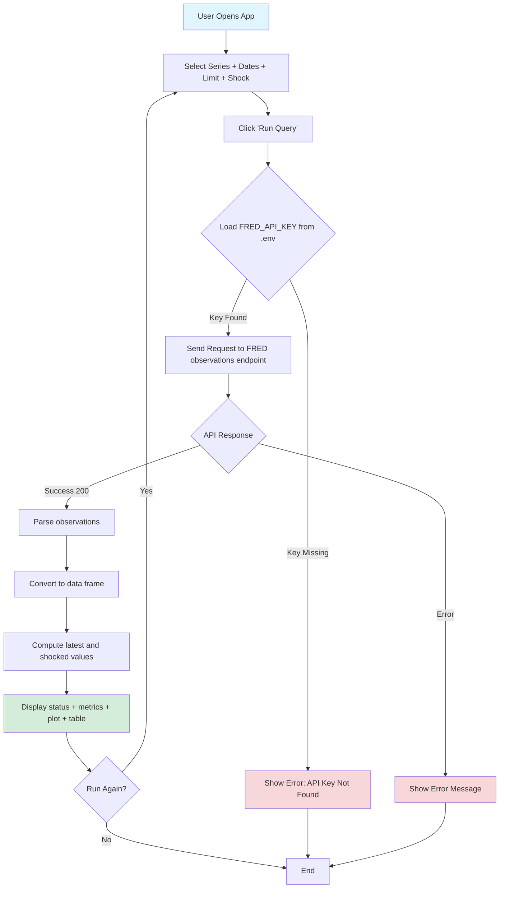
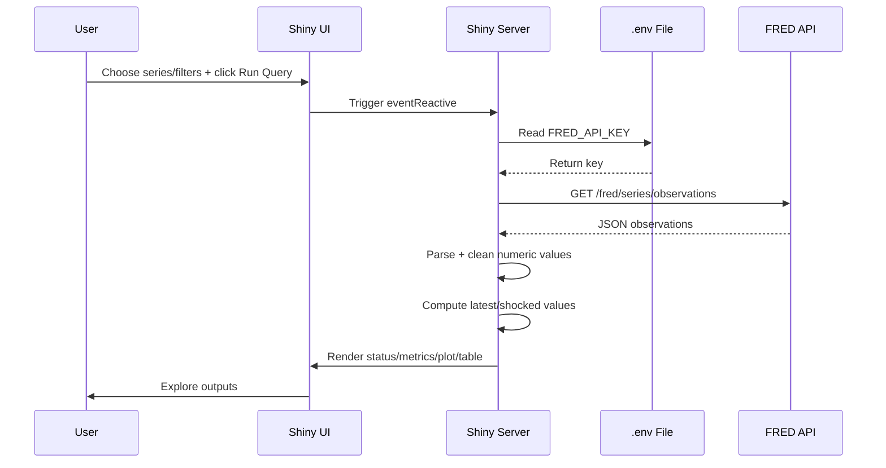
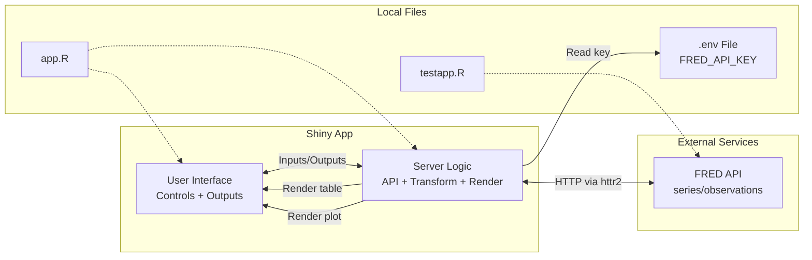

# FRED Macro Dashboard Shiny App

A Shiny web application that queries the Federal Reserve Economic Data (FRED) API and displays macro/financial time-series data in an interactive dashboard for Lab 2.

## Overview

This application provides a user-friendly interface to explore macro and rates data from FRED. Users can:
- Fetch time-series observations from FRED on demand
- Select different indicators (e.g., FEDFUNDS, UNRATE, CPIAUCSL, DGS10)
- Control date range and maximum returned rows
- Apply a simple scenario shock (in basis points) to the latest value
- View results in a plot and interactive data table

### Application Workflow



## Requirements

### Software Requirements
- R (version 4.0 or higher recommended)
- RStudio (optional, but recommended)

### R Package Dependencies
```r
install.packages(c("shiny", "httr2", "DT", "ggplot2"))
```

### API Requirements
- **FRED API Key**: You need a free API key from FRED
  - Get your key at: https://fred.stlouisfed.org/docs/api/api_key.html
  - Add the key in `.env` as `FRED_API_KEY=your_api_key_here`

## Installation

1. **Clone or download this repository**
   ```bash
   git clone <your-repo-url>
   cd <your-repo-folder>
   ```

2. **Install required R packages**
   ```r
   install.packages(c("shiny", "httr2", "DT", "ggplot2"))
   ```

3. **Set up your API key**

   Create a `.env` file in the project root (or app folder):
   ```bash
   # .env file
   FRED_API_KEY=your_api_key_here
   ```

   **Important**: Add `.env` to your `.gitignore` to keep your API key private:
   ```bash
   echo ".env" >> .gitignore
   ```

## Running the App

### Method 1: From RStudio
1. Open `dsai/02_productivity/shiny_app/app.R` in RStudio
2. Click the **Run App** button
3. The app opens in a browser or viewer window

### Method 2: From R Console
```r
shiny::runApp('dsai/02_productivity/shiny_app')
```

### Method 3: From Command Line
```bash
R -q -e "shiny::runApp('dsai/02_productivity/shiny_app')"
```

The app will start and display a URL like `http://127.0.0.1:XXXX`.

## Usage Instructions

1. **Launch the app** using one of the methods above
2. **Choose a FRED series** from the dropdown
3. **Set start and end dates** for the time period
4. **Set max rows** (limit) and **scenario shock (bp)**
5. **Click "Run Query"**
6. **Review outputs**:
   - Status (success/error and row count)
   - Latest value
   - Shocked value (`latest + shock_bp / 100`)
   - Time-series chart
   - Interactive data table (search/sort/page)

## File Structure

```text
shiny_app/
├── app.R           # Main Shiny application file (UI + server + helpers)
├── testapp.R       # CLI script to test FRED request and extraction
├── DESCRIPTION     # Dependency metadata
├── README.md       # Main documentation
└── appREADME.md    # Alternate README copy for submission/workflow compatibility
```

## Troubleshooting

### "FRED_API_KEY not found" Error
- Make sure `.env` exists and includes: `FRED_API_KEY=your_actual_key`
- Ensure there are no extra quotes/spaces
- Start R from the project root or place `.env` near `app.R`

### API Request Failed
- Verify your API key is active and valid
- Confirm internet connectivity
- Check FRED service status and endpoint availability

### Empty or Non-Numeric Results
- Some series/date ranges may return missing values (`.`)
- Try a wider date range or a different series

### Package Installation Issues
```r
options(repos = c(CRAN = "https://cran.rstudio.com/"))
install.packages(c("shiny", "httr2", "DT", "ggplot2"))
```

## API Information

This app uses the FRED API observations endpoint:
- **Base URL**: `https://api.stlouisfed.org/fred/series/observations`
- **Authentication**: API key via query parameter `api_key`
- **Response Format**: JSON (`file_type=json`)
- **Documentation**: https://fred.stlouisfed.org/docs/api/fred/series_observations.html

### Data Flow Sequence



## Features

- ✅ On-demand API query execution
- ✅ Multiple macro/financial series choices
- ✅ Configurable date range and row limit
- ✅ Scenario shock input (basis points)
- ✅ Interactive data table with sorting and search
- ✅ Clean dashboard-style interface
- ✅ API key management via environment variables

## Technical Details

### System Architecture



### Key Dependencies
- **shiny**: web application framework
- **httr2**: HTTP client for API requests
- **DT**: interactive data table rendering
- **ggplot2**: time-series plotting

### Design Decisions
1. Query runs only on button click (no continuous polling)
2. API key is read from `.env` with multiple path fallbacks
3. Error handling wraps API call and returns user-friendly messages
4. Missing/non-numeric values are filtered before plotting
5. Scenario output is intentionally simple for Lab 2 use

## Screenshots

> Add your screenshots here after running locally (per lab submission requirement):

- Running app main view
- Successful query execution
- Results displayed in table/plot
- Error handling example (e.g., missing API key)

Example markdown format:
```markdown


```

## License

This project is provided as-is for educational purposes.

## Author

Lab submission by student (adapted from course workflow).

## Contributing

Feel free to open issues or pull requests for improvements.

## Acknowledgments

- Federal Reserve Bank of St. Louis for FRED API
- Posit/RStudio team for Shiny